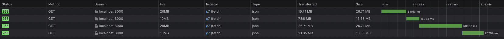

# GZip Comparison of \~20MB and \~10MB payloadeds

## Get started
`go run main.go`

## Results
Request order
* /gzip/20MB
* /gzip/10MB
* /raw/20MB
* /raw/10MB

☝️ At such fast speeds the gzipping takes longer than the request does.

☝️ At slow speeds the gzipped variations are significantly faster.
